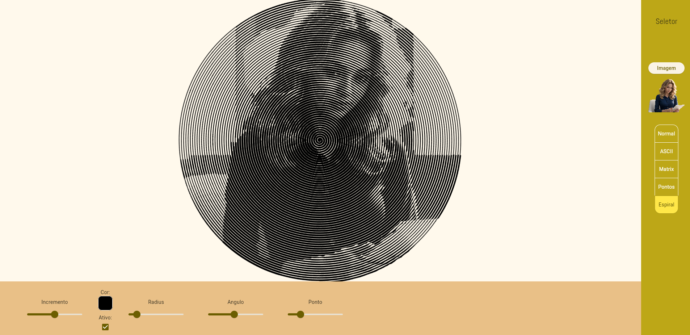

# image_processing

Pequeno projeto para implementar uma série de processamentos de imagem, é um projeto em andamento ainda, sendo implementado mais alguns processamentos e o método de exportar a imagem.
O projeto está sendo feito e testado em ambiente Windows, em ambiente web ainda precisa de otimização e implementação de multiprocessamento (por isso o loading parece quebrado no web).

Tarefas ainda em desenvolvimento:

- Weighted voronoi stippling
- Exportação de imagem
- Mudança de background e transparência
- Otimização, especialmente para navegadores

## ASCII

Substitui cada conjunto de pixel com base em sua luminosidade por um caracter ascii com base em suas próprias luminosidades

## Matrix

Cria uma array de letras chinesas em movimento que alteram sua opcidade de acordo com a luminosidade dos pixels da imagem

## Pontos

Cria um ponto para cada conjunto de pixels podendo esse ponto alterar de raio e opcaidade de acordo com a luminosidade do conjunto de pixels

## Espiral Bety

Cria uma esperial de Arquimedes onde a espessura da linha é afetada pela luminosidade do pixel naquela posição cartesiana

## Weighted Voronoi stippling

Em desenvolvimento

## Exemplo

<https://processadordeimagem.web.app/>

